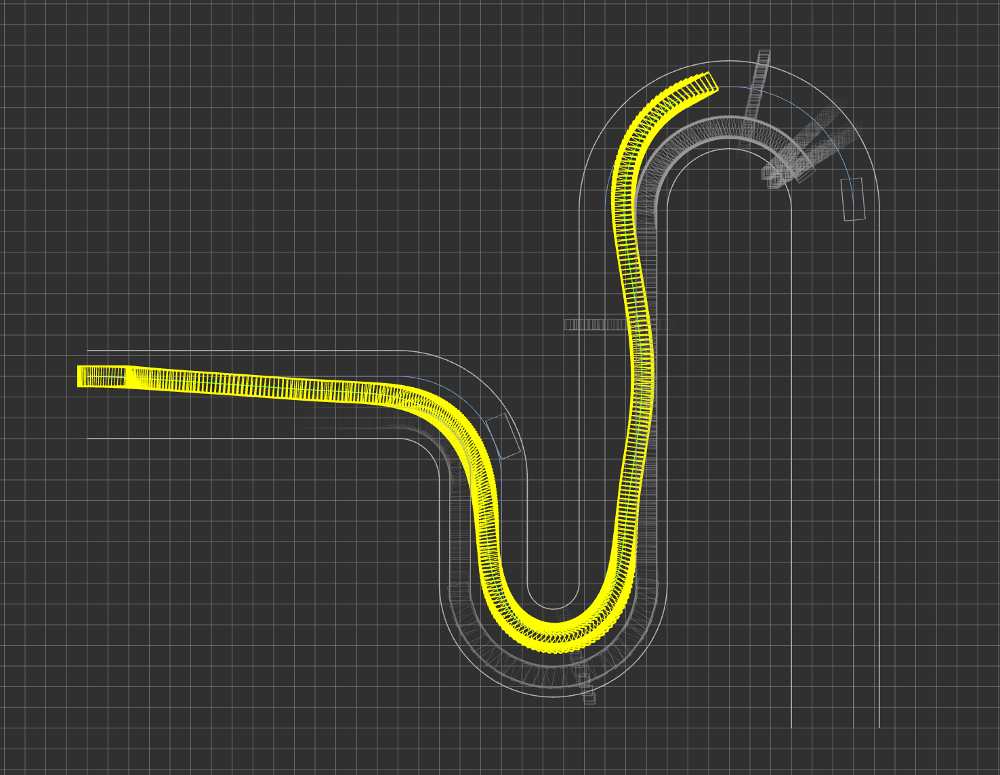

# Cartesian Planner ROS Package

 C++/ROS Source Codes for "Autonomous Driving on Curvy Roads without Reliance on
 Frenet Frame: A Cartesian-based Trajectory Planning Method" published in IEEE Trans. 
 Intelligent Transportation Systems by Bai Li, Yakun Ouyang, Li Li, and Youmin Zhang.



## Installation

1. Request **ma27** linear solver code from [HSL for IPOPT](https://www.hsl.rl.ac.uk/ipopt/), follow the installation instructions from [IPOPT
HSL autotools](https://github.com/coin-or-tools/ThirdParty-HSL).

2. Install deb package from [CASADi Releases](https://github.com/casadi/casadi/releases/tag/3.5.5).

   ```shell
   sudo dpkg -i libcasadi-v3.5.5.deb
   ```

3. Clone repository to any catkin workspace and compile workspace
   
   ```shell
   cd ~/catkin_ws/src
   git clone https://github.com/libai1943/CartesianPlanner.git
   cd .. && catkin_make
   ```

## Example

Random test case with 6 pedestrians, 3 moving vehicles and 2 static vehicles.

```shell
roslaunch cartesian_planner pedestrian_test.launch
```

**Click anywhere in Rviz window with the `2D Nav Goal` Tool to start planning.**


## Acknowledgement

[CASADi](https://github.com/casadi/casadi)

Special thanks to [Baidu Apollo](https://github.com/ApolloAuto/apollo) for common math libraries

---

 Copyright (C) 2022 Bai Li and Yakun Ouyang

 Users must cite the following article if they use the source codes to conduct simulations in their new publications.
 Bai Li, Yakun Ouyang, Li Li, and Youmin Zhang, “Autonomous driving on curvy roads without reliance on Frenet frame: A Cartesian-based trajectory planning method,” IEEE Transactions on Intelligent Transportation Systems, available at https://doi.org/10.1109/TITS.2022.3145389, accepted, 2022.
